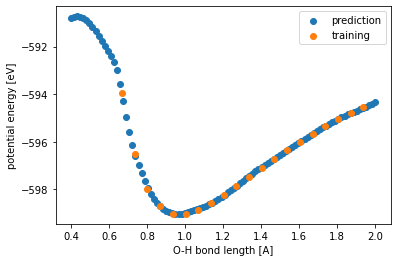

.. _usage:

==================================
Usage
==================================

Training and Predicting with 2D Water Trajectory
^^^^^^^^^^^^^^^^^^^^^^^^^^^^^^^^^
In this section, we demonstrate how to train a NNFF with AmpTorch on an ase 
trajectory of a water molecule and visualize the potential energy surface (PES). 
In the trajectory of a single water molecule, one O-H bond length is fixed, and the 
other O-H length and the H-O-H bond angle are allowed to vary, hence 2D PES. 
This dataset is calculated by Quantem Espresso (xc: PBE. kpts: (1,1,1). Planewave: 500). 

To start, we load all images in the trajectory: 

.. code-block:: python

   import matplotlib.pyplot as plt
   import ase
   import ase.io
   from amptorch.ase_utils import AMPtorch
   from amptorch.trainer import AtomsTrainer

   # read all images from the trajectory
   images = ase.io.read("./water_2d.traj", index=":") # no train-test/holdout split for demo purpose

We skipped train-test-split step here for the simplicity of a demo case. 

Then, we define the hyperparameters of GMP fingerprinting scheme in radial probes(nsigmas) and their range (max_radial_sigma), and angular probes (max_MCSH_order): 

.. code-block:: python

   sigmas = np.linspace(0, max_radial_sigma, nsigmas + 1, endpoint=True)[1:]
   GMPs = {
      "MCSHs": {"orders": list(range(max_MCSH_order + 1)), "sigmas": sigmas},
   }

Next, we define the training configuration with aspects including choice of model, optimizer and fingerprinting scheme: 

.. code-block:: python

   config = {
      # model choices of neural network force fields
      "model": {
         "name": "singlenn",  # neural network architecture
         "get_forces": True, # for structure to energy and forces (S2EF) task
         # "num_layers": 3,
         # "num_nodes": 20,
         "hidden_layers": [20,20,20], # setting the dimensions of the 2nd to 4th hidden layers to 20
         "activation": torch.nn.Tanh,
         "batchnorm": True,
      },
      # optimization schemes associated with training
      "optim": {
         "device": "cpu", # device
         "force_coefficient": 0.01, # adjust the loss of energy vs. forces
         "lr": 1e-3, # learning rate
         "batch_size": 16, # batch size in training
         "epochs": 500, # total number of iterations of optimization
         "loss": "mse", # loss function evaluation
         "metric": "mae", # evaluation metrics
      },
      # dataset processing and fingerprinting
      "dataset": {
         "raw_data": images, # list of ase.Atoms objects for training (and validation)
         "val_split": 0, # validation fraction
         "fp_scheme": "gmpordernorm", # fingerprinting scheme
         "fp_params": GMPs, # fingerprinting parameters
         "save_fps": False, # whether to save fingerprints
      },
      # other commands
      "cmd": {
         "debug": False,
         "run_dir": "./",
         "seed": 1,
         "identifier": "2d_water",
         "verbose": True,
         "logger": False,
      },
   }

To start training: 

.. code-block:: python

   # train
   torch.set_num_threads(1)
   trainer = AtomsTrainer(config)
   trainer.train()

Finally, we'd like to make predictions on how the potential energy changes with varying O-H bond length with the H-O-H angle at around equilibrium bond angle (104.21 degrees). We first obtained the ground truth DFT values from loaded trajectory, and compared with NNFF predictions. 

.. code-block:: python

   # ground truth DFT 
   training_angle100 = [_ for _ in images if np.isclose(_.get_angle(1, 0, 2), 104.210, atol=1e-3)]

   distances_training = [_.get_distance(0, 2) for _ in training_angle100]
   energies_training = [_.get_potential_energy() for _ in training_angle100]

   # predicted NNFF
   distances = np.linspace(0.4, 2.0, 100)
   images_new = []
   for dist in distances:
      image = molecule("H2O", vacuum=10.0)
      image.set_cell([10, 10, 10])
      image.set_pbc([1, 1, 1])

      # change bond length
      image.set_distance(0, 2, dist)
      image.set_angle(1, 0, 2, 104.210)
      images_new.append(image)

   predictions = trainer.predict(images_new)

Finally, we plot the prediction vs. training values of the 1D PES: 

.. code-block:: python
   # predict on arbitrary O-H length
   fig, ax = plt.subplots()
   ax.scatter(distances, predictions["energy"], label="prediction")
   ax.scatter(distances_training, energies_training, label="training")
   ax.set_xlabel("O-H bond length [A]")
   ax.set_ylabel("potential energy [eV]")
   ax.legend()

   # save figure
   fig.savefig("predicted_1D_water_PES.png")

The plotted 1D PES should look like: 

We can see that while the predictions are more true to the underlying DFT data (labeled orange) where 
there are enough data to make reliable interpolation, but the NNFF fails to predict the steep increase 
in energy when the interatomic distance is significantly reduced. Hence, the NNFF cannot be trusted 
in extrapolation region. 

The above example demonstrates a regular structure-to-energy-and-forces (S2EF) training, 
and is contained in:

::

   examples/4_misc/2D_water_example.py

If you'd like to jumpstart training a NNFF, we recommend consulting with the `example <https://github.com/ulissigroup/amptorch/tree/master/examples>`_ folder that covers major tasks, such as structure to energy (S2E), uncertainty, and different feature and neural network architectures. 

In later section of Usage, we listed severl key variables and functions that will be used for NNFF training and evaluation. 

Configs
^^^^^^^

An exhaustive list of flags and their descriptions for the configuration of AmpTorch trainer is provided below:

.. code-block:: python

   configs = {
   "model": {
         "num_layers": int,            # No. of hidden layers
         "num_nodes": int,             # No. of nodes per layer
         "get_forces": bool,           # Compute per-atom forces (default: True)
         "batchnorm": bool,            # Enable batch-normalization (default:False)
         "activation": object,         # Activation function (default: nn.Tanh)
   },
   "optim": {
         "gpus": int,                  # No. of gpus to use, 0 for cpu (default: 0)
         "force_coefficient": float,   # If force training, coefficient to weight the force component by (default: 0)
         "lr": float,                  # Initial learning rate (default: 1e-1)
         "batch_size": int,            # Batch size (default: 32)
         "epochs": int,                # Max training epochs (default: 100)
         "optimizer": object,          # Training optimizer (default: torch.optim.Adam)
         "loss_fn": object,            # Loss function to optimize (default: CustomLoss)
         "loss": str,                  # Control loss function criterion, "mse" or "mae" (default: "mse")
         "metric": str,                # Metrics to be reported by, "mse" or "mae" (default: "mae")
         "cp_metric": str,             # Property based on which the model is saved. "energy" or "forces" (default: "energy")
         "scheduler": dict,            # Learning rate scheduler to use
                  ##            - {"policy": "StepLR", "params": {"step_size": 10, "gamma": 0.1}}
   },
   "dataset": {
         "raw_data": str or list,      # Path to ASE trajectory or database or list of Atoms objects
         "lmdb_path": str,             # Path to LMDB database file for dataset too large to fit in memory
                        ## Specify either "raw_data" or "lmdb_path"
                  ## LMDB construction can be found in examples/3_lmdb/
         "val_split": float,           # Proportion of training set to use for validation
         "elements": list,             # List of unique elements in dataset, optional (default: computes unique elements)
         "fp_scheme": str,             # Fingerprinting scheme to feature dataset, "gmpordernorm" or "gaussian" (default: "gmpordernorm")
         "fp_params": dict,            # Fingerprint parameters, see examples for correct layout for either GMP descriptors or SF descriptors
         "cutoff_params": dict,        # Cutoff function for SF descriptors - polynomial or cosine,
                                       ## Polynomial - {"cutoff_func": "Polynomial", "gamma": 2.0}
                                       ## Cosine     - {"cutoff_func": "Cosine"}
         "save_fps": bool,             # Write calculated fingerprints to disk (default: True)
         "scaling": dict,              # Feature scaling scheme, normalization or standardization
                                       ## normalization (scales features between "range")
                                                   - {"type": "normalize", "range": (0, 1)}
                                       ## standardization (scales data to mean=0, stdev=1)
                                                   - {"type": "standardize"}
   },
   "cmd": {
         "debug": bool,                # Debug mode, does not write/save checkpoints/results (default: False)
         "dtype": object,              # Pytorch level of precision (default: torch.DoubleTensor)
         "run_dir": str,               # Path to run trainer, where logs are to be saved (default: "./")
         "seed": int,                  # Random seed (default: 0)
         "identifier": str,            # Unique identifer to experiment, optional
         "verbose": bool,              # Print training scores (default: True)
         "logger": False,              # Log results to Weights and Biases (https://www.wandb.com/)
                                       ## wandb offers a very clean and flexible interface to monitor results online
                                       ## A free account is necessary to view and log results
   },
   }

Train model
^^^^^^^^^^^

.. code-block:: python

   from amptorch import AtomsTrainer

   trainer = AtomsTrainer(configs)
   trainer.train()

Load checkpoints
^^^^^^^^^^^^^^^^

Previously trained models may be loaded as follows:

.. code-block:: python

   trainer = AtomsTrainer(configs)
   trainer.load_pretrained(path_to_checkpoint_dir)

Make predictions
^^^^^^^^^^^^^^^^

.. code-block:: python

   predictions = trainer.predict(list_of_atoms_objects)
   energies = predictions["energy"]
   forces = predictions["forces"]

Construct AmpTorch-ASE calculator
^^^^^^^^^^^^^^^^^^^^^^^^^^^^^^^^^

To interface with ASE, an ASE calculator may be constructed as follows:

.. code-block:: python

   from amptorch import AmpTorch

   calc = AmpTorch(trainer)
   slab.set_calculator(calc)
   energy = slab.get_potential_energy()
   forces = slab.get_forces()

